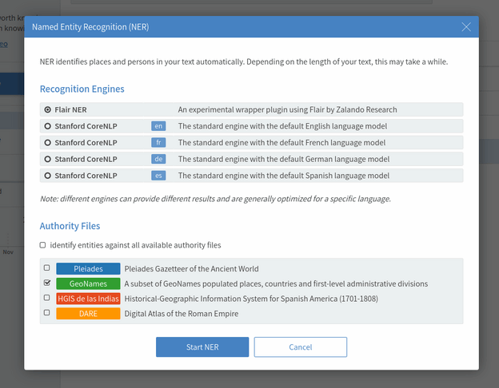

# Recogito Flair NER Plugin

An (experimental) plugin to the [Recogito annotation platform](http://github.com/pelagios/recogito2) 
that adds [Flair](https://github.com/zalandoresearch/flair) by 
[Zalando Research](https://research.zalando.com/) as a Named Entity Recognition Engine. 

The plugin consists of two parts:

1. a minimal Python script that takes a filename as input, runs 
   NER with Flair, and writes JSON results to STDOUT
2. a Scala wrapper that implements the Recogito plugin interface, 
   and calls out to the Python script via the command line



## Pre-Requisites

Make sure Flair is installed on your system: `pip install flair`

## Testing

To run __just the Python script__ use

```
python plugins/recogito.plugins.ner.flair/parse.py {filename}
```

To test parsing throught the Scala wrapper run

```
sbt test
```

## Compile and Deploy

- build the plugin using `sbt package`. This will create the 
  .jar file `target\recogito-plugin-ner-flair-0.1.jar`. 
- copy the .jar into a subfolder __inside__ the Recogito 
  `/plugins` folder
- copy the Python script to the same subfolder
- make sure Flair is installed on the Recogito server 
